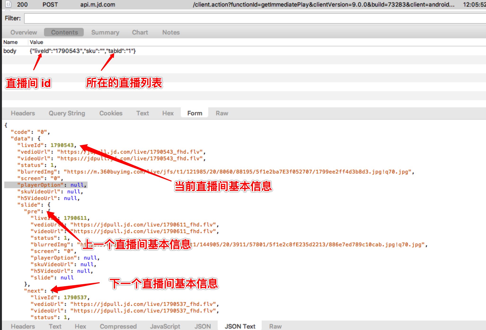
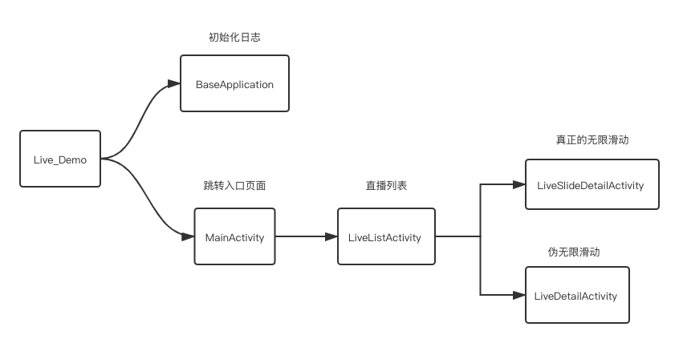

---
### 前言

项目如果对你有帮助,帮我点个 Star,谢谢 !

---
### Android - 直播布局（1）
2020 年以来，因为疫情原因，直播格外的火。很多应用都引入了直播功能，我在写直播布局的时候，遇到了不少的问题，为了让后人少踩坑，写了个 Demo，希望能对以后做直播的人有所借鉴。

---
###  演示


项目地址： 
https://github.com/ilpanda/live_demo

apk 下载地址（在 Github 上，下载可能较慢）：

https://github.com/ilpanda/live_demo/blob/master/app-release.apk

---
### 基本功能
Demo 实现的功能仅仅是布局，没有实现直播以及 IM 功能，因为这些功能基本用的都是第三方服务，如腾讯云直播、阿里云直播。

直播布局以京东、淘宝直播为参照。直播布局支持的基本功能：

1. 支持竖屏和横屏两种样式，支持横屏全屏。
2. 支持上下滑动。京东和淘宝的直播都是支持上下无限滑动的。

---
###  上下滑动布局分析
直播和 IM 是比较消耗资源的，因此创建这些组件时都是使用的单例。直播布局支持上下滑动，也就意味着视觉上是多个直播布局，但实际上同一时刻只有一个直播。

上下滑动的组件大家首先会想到 RecyclerView。直播上下滑动确实可以使用 RecyclerView ，但我选择使用 ViewPager ，原因有两个：

1. RecyclerView 直播方面可用的参考资料比较少。

2. 京东、天猫等主流 App 使用的都是 ViewPager 来做上下滑动，因此我推测使用 RecyclerView 会有一些坑，所以直接使用了 ViewPager 来做上下滑动 。（使用 Android SDK 中的 uiautomatorviewer 可以查看其它 App 所使用的组件。）

系统自带的 ViewPager 只支持左右滑动，因此我们直接使用开源组件：https://github.com/castorflex/VerticalViewPager ，VerticalViewPager 支持上下滑动。Android 的新组件 ViewPager2 也支持竖直上下滑动，其内部是对 RecyclerView 的封装，但这里还是紧跟大厂的脚步。


---
###  京东上下滑动接口分析
京东、淘宝直播看起来像上下无限滑动，因为他们的直播多，并且可以根据用户的停留时间做个性化推荐直播。首先分析下京东的直播接口：

京东的直播在滑动时，主要请求了两个接口：
1. 根据直播间的 id，请求直播间的详细信息。
2. 根据当前直播的直播间 id ，以及直播列表的类型，获取上一个直播以及下一个直播，从而实现无限滑动。

这里主要贴下第二个接口（京东对接口做了校验，第二次请求时会失效，因此这里贴个图片，就不贴接口了）：


---
### Demo 中的上下滑动实现 - 方案（1）
接口在设计上，参照京东的接口。传递一个直播间 id , 服务器返回当前直播间、前一个直播间以及下一个直播间的信息，从而实现无限滑动。

接口地址： 
https://www.hi-cat.cn/api/live/slide?liveId=

如果 liveId 传递值为空，则默认返回第一个直播间信息。

---
### Demo 中的上下滑动实现 - 方案（2）
我们的业务没有那么多的直播，所以上下无限滑动的接口设计上和京东的不一样，使用列表分页接口，实现无限滑动，这种方案，客户端需要做很多的逻辑判断。

用户从直播列表进入直播间，携带如下参数，获取分页的列表数据：
1. page：标识请求的第几页数据。
2. count：每页的数据，一般为固定值，如 10 或者 20 个。
3. liveId：在直播间列表点击的直播。这个参数不是传递给服务器，是客户端根据服务器返回的列表数据，确定应该移动到哪个直播间。之所以不传递 position，是因为用户点击进入直播间之后，直播可能已经结束。因此使用 liveId 和服务器传递的数据比对，如果不存在，则移动到当前列表的第一条数据。

接口地址： 
https://www.hi-cat.cn/api/live?page=1&count=10

---
### 优劣
1. 方案一，客户端很好处理，不需要额外的逻辑处理，需要后端支持。
2. 方案二，后端直接返回分页后的直播间信息，客户端根据直播间 id 确定位置，需要客户端做额外的逻辑处理。 


---

###  Android - 直播布局（2）

---
### 项目的基础结构
项目基础结构如下： 



1. BaseApplication 初始化日志以及 UncaughtExceptionHandler ，主要用于日志打印和异常捕获，不影响这个项目。
2. MainActivity  应用的入口 Activity，该页面有两个入口，直播列表页面的数据完全一样，直播列表点击进入直播间以后，使用不同的服务器接口来实现上下滑动。
3. LiveListActivity 直播列表页面。
4. LiveSlideDetailActivity  直播详情页，仿京东接口实现的上下滑动，该页面使用的接口 https://www.hi-cat.cn/api/live 
5. LiveDetailActivity  直播详情页，使用直播间列表分页实现的上下滑动，该页面使用的接口 https://www.hi-cat.cn/api/live/slide

---
###  项目依赖

```
   ... 
   // 图片加载
    implementation 'com.github.bumptech.glide:glide:4.9.0'
    annotationProcessor 'com.github.bumptech.glide:compiler:4.9.0'

    // 网络请求
    implementation 'com.squareup.okhttp3:okhttp:3.11.0'
    // 事件总线
    implementation 'org.greenrobot:eventbus:3.2.0'

    // Gson
    implementation 'com.google.code.gson:gson:2.8.6'

    // 日志框架
    implementation 'com.tencent.mars:mars-xlog:1.2.3'

    // 弹幕库
    implementation 'com.github.ctiao:DanmakuFlameMaster:0.9.25'
    implementation 'com.github.ctiao:ndkbitmap-armv7a:0.9.21'

    // leakcanary
    debugImplementation 'com.squareup.leakcanary:leakcanary-android:2.4'

    // 下拉刷新组件
    implementation 'com.scwang.smart:refresh-layout-kernel:2.0.1'      
    implementation 'com.scwang.smart:refresh-header-classics:2.0.1'  

```

---
###  代码介绍
以 LiveSlideDetailActivity 为例，其上下滑动时，调用的方法为：
```
        mViewPager.setPageTransformer(false, new ViewPager.PageTransformer() {
            @Override
            public void transformPage(View page, float position) {
                if (mList.size() == 0 || mIsNotifyData) {
                    return;
                }
                ViewGroup viewGroup = (ViewGroup) page;
                if ((position < 0 && viewGroup.getId() != mCurrentItem)) {
                    // room_container 为视频播放的根布局 id
                    View rootView = viewGroup.findViewById(R.id.room_container);
                    if (rootView != null && rootView.getParent() != null && rootView.getParent() instanceof ViewGroup) {
                        ((ViewGroup) (rootView.getParent())).removeView(rootView);
                        mLiveProxy.onRemove();
                    }
                }

                // 满足此种条件，表明需要加载直播视频，以及聊天室了
                if (viewGroup.getId() == mCurrentItem && position == 0 && mLastItem != mCurrentItem) {
                    View rootView = mLiveProxy.getRootView();
                    if (rootView.getParent() != null && rootView.getParent() instanceof ViewGroup) {
                        ((ViewGroup) (rootView.getParent())).removeView(rootView);
                        mLiveProxy.onRemove();
                    }
                    loadData(viewGroup, mCurrentItem);

                    // 页面滑动时,预加载上一页和下一页的数据
                    LiveItemBean data = mList.get(mCurrentItem);
                    getLiveSlide(data.getLiveId());
                }
            }
        });

```
当竖直 ViewPager  滑动到某一 item 的时候，首先将直播间的布局从上一个 item 移除，同时销毁直播间数据。然后将直播间布局添加到当前 item ，同时加载直播间数据。


---
### LiveProxy
LiveProxy：因为既要支持竖屏直播间、又要支持横屏直播间，两种直播间的界面和逻辑有较大差别。因此使用 LiveProxy 为代理入口类，目的是避免将所有代码写到一个类中。当然这里也可以使用 Fragment，只是我平时开发不喜欢用 Fragment，因为有些 Fragment 崩溃的 Bug 不好定位。

LiveProxy 除了代理 Activity 的生命周期方法以外，还有两个重要的方法： onAdd  和 onRemove。

onAdd：用户滑动显示该页面时候调用，在这个方法里初始化直播、聊天室。

onRemove：  用户滑动移除该页面，在这个方法里销毁直播、聊天室。


---
### PortraitLiveManager 
竖屏直播间的 UI 和  逻辑处理。

---
###  LandscapeLiveManager
横屏直播间的 UI 和  逻辑处理。


---
### 项目引用

1. 点赞动画（单独抽取）：https://github.com/tencentyun/MLVBSDK
2. 横屏上方弹幕：https://github.com/bilibili/DanmakuFlameMaster  bilibili 开源的弹幕组件，现在基本不怎么维护了，有比较多的 Bug，网上相关的资料不多。
3. 竖直滑动组件：https://github.com/castorflex/VerticalViewPager  项目中对该组件有细微的改动，即横屏全屏的时候，禁止滑动。
4. EventBus :  https://github.com/greenrobot/EventBus

---
###  EventBus
其实就 Demo 而言没有必要使用  EventBus，主要我是 EventBus 重度使用者。

直播间的业务必然有很多网络请求，此时需要注意一种情况：

在直播间内点赞，然后发送网络请求同步 -> 用户快速滑动到另一个直播间 -> 网络请求返回，此时需要刷新点赞数，但是当前直播间和点赞的直播间已经不是一个直播间了。因此，网络请求回调，需要判断当前直播间是否和发送网络请求的直播间是否为同一个直播间。

我使用 EventBus 主要有几个原因：
1. 简化回调代码。
2. 处理 Activity 退出后，网络请求仍在执行，造成的内存泄露。
3. 跨组件、跨 module 通信。

当然开发过程中要注意看错误日志，默认情况下，EventBus 会捕获事件处理中的异常，并将其打印。


---
###  接口数据来源
1. 直播列表中的 blurImg 来源于京东。
2. 直播广播列表的数据来源于 Acfun。


---
### TODO
1. 天猫和京东的直播布局，支持单击隐藏、左右滑动直播间隐藏。其实左右滑动的实现是一个水平的 ViewPager。
2. 悬浮窗。


